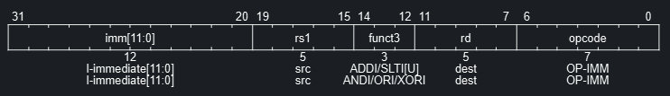
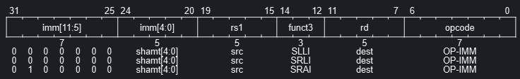
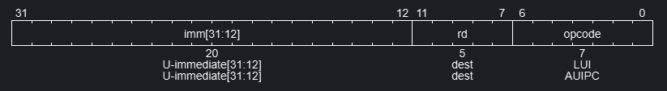
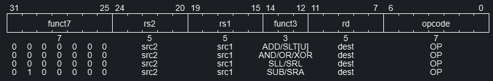
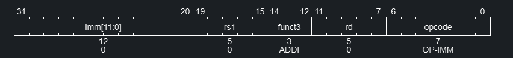

## Machine Code Layout

RV32I 一共有 6 種指令：

| Type   | 31 : 25                  | 24 : 20   | 19 : 15   | 14 : 12   | 11 : 7       | 6 : 0   |
| ------ | ------------------------ | --------- | --------- | --------- | ------------ | ------- |
| R-type | funct7                   | rs2       | rs1       | funct3    | rd           | opcode  |
| I-type | imm[11:0]                |           | rs1       | funct3    | rd           | opcode  |
| S-type | imm[11:5]                | rs2       | rs1       | funct3    | imm[4:0]     | opcode  |
| B-type | imm[12\|10:5]            | rs2       | rs1       | funct3    | imm[4:1\|11] | opcode  |
| U-type | imm[31:12]               |           |           |           | rd           | opcode  |
| J-type | imm[20\|10:1\|11\|19:12] |           |           |           | rd           | opcode  |

- **R-type** — 處理「兩個暫存器之間」的算術或邏輯運算。
- **I-type** — 處理「一個暫存器與一個常數」的運算，或是從記憶體「讀取」資料。
- **S-type** — 將暫存器的資料「存入」記憶體。
- **B-type** — 根據比較結果決定是否「跳轉」程式碼位址（實作 if-else 或 loop）。
- **U-type** — 處理「大數字」或「全域變數位址」。
- **J-type** — 進行「長距離」的無條件跳轉（常用於呼叫函數）。

## Integer Computational Instructions

### Integer Register-Immediate Instructions

- **ADDI** — ADDI (Add immediate) 指令會將一個經 sign-extended 的 12 位元立即值（immediate）加到暫存器 rs1 上。計算過程中會忽略算術溢位（arithmetic overflow），結果僅取運算值低位元的 XLEN 位元。

- **SLTI[U]**
  - SLTI (set less than immediate)：當暫存器 rs1 與符號擴展（sign-extended）的立即值皆被視為**有號數（signed numbers）** 進行比較時，若 rs1 的值小於該立即值，則在目標暫存器 rd 中寫入 1；否則，在 rd 中寫入 0。
  - SLTIU 的運作方式與 SLTI 類似，但會將數值視為**無號數（unsigned numbers）** 進行比較（立即值會先進行符號擴展至 XLEN 位元，接著再被視為無號數來處理）。

- **ANDI/ORI/XORI**
  * ANDI、ORI、XORI 是邏輯運算指令，分別對暫存器 rs1 與符號擴展（sign-extended）的 12 位元立即值進行位元級（bitwise）的 AND（及）、OR（或）與 XOR（互斥或）運算，並將結果存入目標暫存器 rd。

- **SLLI/SRLI/SRAI**
  - 常數位元的位移是用 I-type 格式來描述。
  - 右移分成邏輯 (Logical) 右移和算數 (Arithmetic) 右移。
  - 邏輯右移 MSB 會補 0，算數右移則會補與 MSB 相同的值。

- **LUI** (Load upper immediate)
  * LUI 用於建構 32 位元的常數，他會把 20-bit U-immediate 放入 rd 的高 20 位元中，低 12 位元則補 0。

- **AUIPC** (Add upper immediate to PC)
  * AUIPC 用於建構 PC-relative 的位址，並採用 U-type 格式。AUIPC 會根據 U-immediate 形成一個 32 位元的偏移量（將低 12 位元補零），接著將此偏移量與 AUIPC 指令本身的位址相加，最後將結果存入目標暫存器 rd。因為低 12 位元補零，故地址為 rd 的結果只能落在以 4KB 為間隔的地址上。

### Integer Register-Register Operations

- **ADD/SUB**
  * ADD 將 rs1 加上 rs2 的結果置於 rd；SUB rs1 減去 rs2 的結果置於 rd。
  * SLT/SLTU 若 `rs1 < rs2`，則將 rd 設為 1，反之則為 0，SLTU 為無號數的比較情況。
- **ADD/AND/OR/XOR**
  * 皆為位元操作。
- **SLL/SRL/SRA**
  * 分別為邏輯左移、邏輯右移、算術右移。
  * 只有算術右移會在最高位補上相同的 0/1。

### NOP Instruction

- **NOP**
  * NOP 不會改變任何狀態，除了 Program counter 的更新。
  * NOP 會被編碼成 ADDI x0, x0, 0。